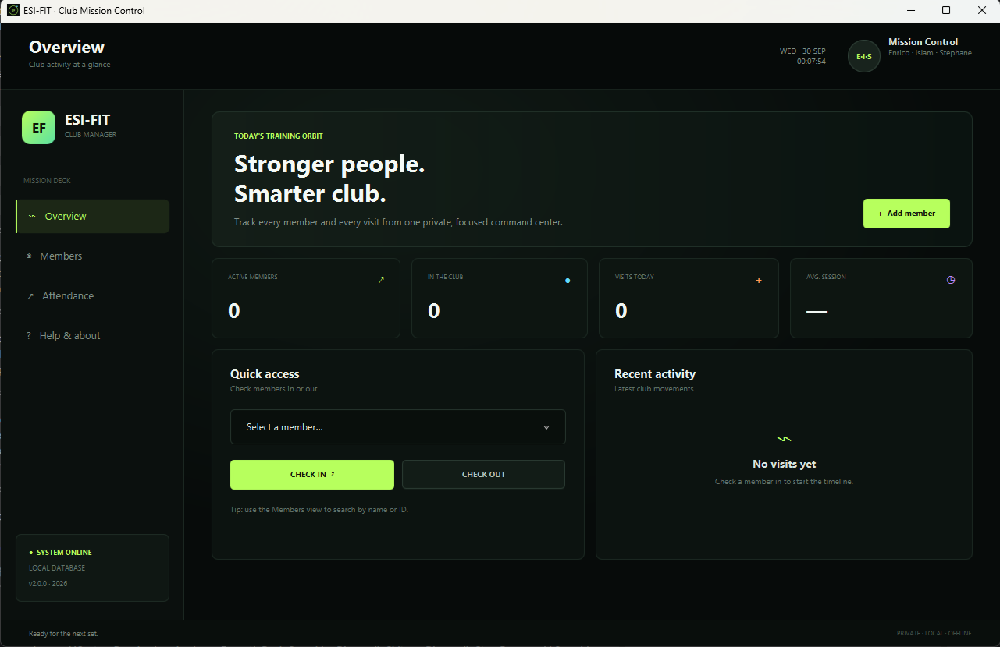

<div align="center">
  
  <h1>ESI-FIT</h1>
  <p><strong>Stronger people. Smarter club.</strong></p>

  [](https://github.com/sofoste93/ESI-FIT-CM-APP/releases/latest)
  [](https://github.com/sofoste93/ESI-FIT-CM-APP/actions)
  [](LICENSE)
</div>



ESI-FIT is a private desktop manager for fitness club members and attendance. Version 2 replaces the original JavaFX prototype with a focused command center that is reliable to install and pleasant to use every day.

## What it manages

- Live dashboard with active members, current occupancy, today's visits, and average session duration
- Searchable member profiles with email, plan, join date, and active or paused status
- One-click check-in and check-out with duplicate open-session protection
- Complete attendance archive with live durations and CSV export
- Transactional local database with automatic recovery of the legacy text files

All information remains on the computer. ESI-FIT has no account, cloud service, analytics, or remote database.

## Install

Download the package for your platform from the [latest release](https://github.com/sofoste93/ESI-FIT-CM-APP/releases/latest):

| Platform | Recommended | Portable option |
| --- | --- | --- |
| Windows x64 | `.exe` installer | `.zip` application |
| Linux x64 | `.deb` package | `.tar.gz` application |
| macOS Intel | `.dmg` disk image | `.tar.gz` application |
| macOS Apple Silicon | `.dmg` disk image | `.tar.gz` application |

Every package includes a purpose-built Java runtime. **Java does not need to be installed or configured on the device.**

On macOS, the application is currently unsigned. If Gatekeeper blocks the first launch, control-click the app and choose **Open**, or allow it under **System Settings → Privacy & Security** after verifying the download.

## Data and migration

The embedded database is stored in the standard application-data location:

- Windows: `%LOCALAPPDATA%\ESI-FIT`
- Linux: `$XDG_DATA_HOME/esi-fit` or `~/.local/share/esi-fit`
- macOS: `~/Library/Application Support/ESI-FIT`

When version 2 starts with an empty database, it looks for the original `clients.txt` and `sessions.txt` beside the application's launch location. Valid legacy records are imported automatically; malformed rows are safely ignored. After verifying the migration, archive those text files somewhere private.

## Run from source

Requirements: JDK 17 and Maven, or simply JDK 17 with the included Maven wrapper.

```bash
git clone https://github.com/sofoste93/ESI-FIT-CM-APP.git
cd ESI-FIT-CM-APP
./mvnw clean javafx:run
```

On Windows, use `mvnw.cmd clean javafx:run`.

Run the automated tests:

```bash
./mvnw clean verify
```

Build a portable application with an embedded runtime:

```bash
# Linux / macOS
./scripts/package.sh app-image

# Windows PowerShell
./scripts/package.ps1 -PackageType app-image
```

Pushing a `v*` tag runs native builds on all four target systems, executes database and packaged-runtime diagnostics, creates installers and portable archives, then publishes one GitHub release.

## Team

Created and maintained by **Enrico Dück, Islam Nasif, and Stephane Sob Fouodji**.

This project is released under the [MIT License](LICENSE).

**THOR // transmission complete. Training orbit stable.**
